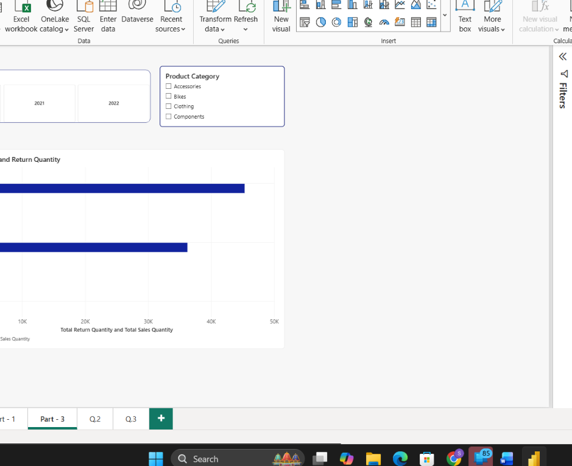
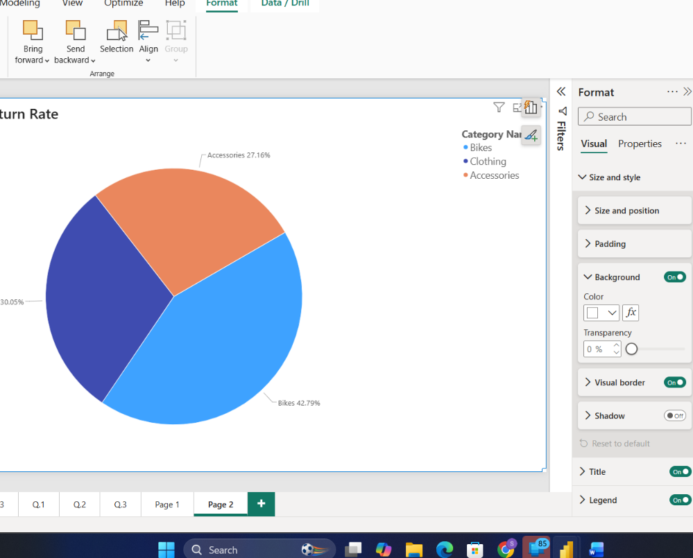
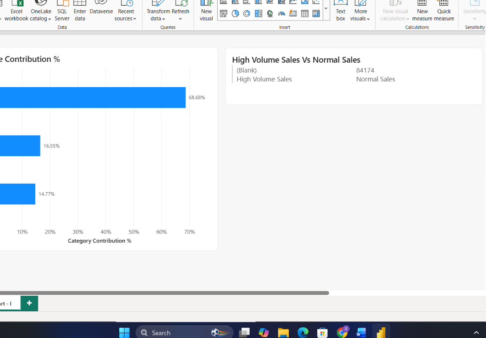
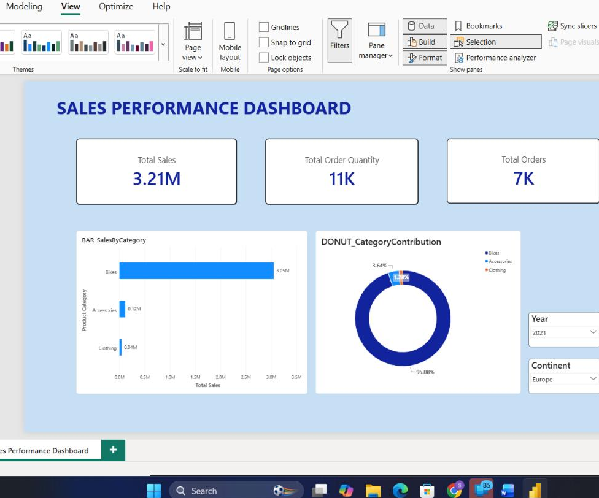
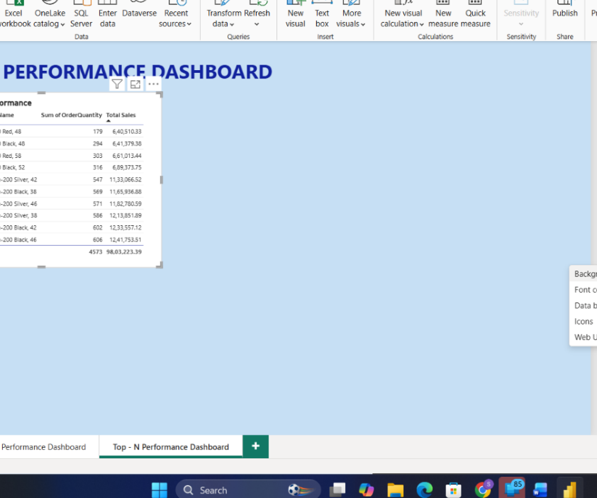

# Simran Ghag — Power BI Portfolio (Tutedude Certification)

**Certified in Power BI** through Tutedude's hands-on, project-based program (completed 30/07/2026). This repo contains all 20 tasks — data modeling, DAX, and dashboard design — written up in my own words: what I built, what I found in the data, and what actually clicked along the way, rather than a checklist of completed steps.

📄 **[View Certificate →](./certificate/certificate.pdf)**

> **Note:** The capstone project is maintained in a separate, dedicated repository, as it is intended to stand alone as an independent portfolio piece.

---

## Skills Demonstrated

`Power Query (Append & Merge)` `Star Schema Data Modeling` `Relationships & Cardinality` `DAX Measures & Calculated Columns` `CALCULATE, ALL, FILTER` `Iterator Functions (SUMX/AVERAGEX)` `Time Intelligence (YTD, YoY, Rolling Averages)` `KPI Dashboards` `Maps & Geographic Visuals` `Top-N Filtering` `Drill-Through` `Bookmarks & Navigation` `What-If Parameters`

---

## Progression

The tasks build up in a natural arc: tool basics → proper data modeling with fact/dimension tables → a long stretch of DAX (simple aggregations through time intelligence and iterator functions) → a series of dashboard-building tasks that bring everything together into something genuinely interactive.

## Tasks

| # | Project | Preview | What It Demonstrates |
|---|---------|---------|------------------------|
| 1 | [Getting Started with Power BI](./Task-01) |  | Installation, interface exploration, Report/Data/Model views |
| 2 | [Sales Data Integration & Modeling](./Task-02) |  | Power Query append, Fact_Sales, Dim_Product |
| 3 | [Returns Analysis & Territory Integration](./Task-03) |  | Fact_Returns, Dim_Territory, conditional columns |
| 4 | [Data Model Design & Optimization](./Task-04) |  | Relationships, cardinality, Star Schema validation |
| 5 | [Relationship Behavior & Model Stress Testing](./Task-05) |  | Inactive relationships, filter flow, bidirectional filtering |
| 6 | [Model Optimization & Usability Enhancement](./Task-06) |  | Layout, data categories, hierarchies |
| 7 | [DAX Measures & Analytical Insights](./Task-07) |  | Calculated columns, explicit measures, Quick Measures |
| 8 | [Conditional Logic, SWITCH & Text Functions in DAX](./Task-08) |  | IF/SWITCH classification, text functions |
| 9 | [Time Intelligence with DAX](./Task-09) |  | Date functions, period comparisons |
| 10 | [RELATED, CALCULATE & Measure Totals](./Task-10) |  | Cross-table lookups, filter context |
| 11 | [ALL, FILTER & Iterator Functions in DAX](./Task-11) |  | Contribution %, SUMX/AVERAGEX |
| 12 | [Time Intelligence Patterns in DAX](./Task-12) |  | YTD, YoY Growth, Rolling averages |
| 13 | [Executive Dashboard Design](./Task-13) |  | Page layout, KPI cards, Selection Pane grouping |
| 14 | [Sales Trend & Forecast Analysis](./Task-14) |  | Line chart, trend line, forecast |
| 15 | [Sales Performance Dashboard](./Task-15) |  | KPIs, bar/donut charts, synced slicers |
| 16 | [Top-N Performance Dashboard](./Task-16) |  | Top-N filtering, conditional formatting, matrix |
| 17 | [Geographic Sales Dashboard](./Task-17) |  | Map & filled map visuals |
| 18 | [Advanced Interactive Dashboard](./Task-18) |  | Gauge, drill hierarchy, HASONEVALUE, dynamic formatting |
| 19 | [Drill-Through & Report Interactions](./Task-19) |  | Drill-through pages, controlled interactions |
| 20 | [Bookmarks, Navigation & Parameters](./Task-20) |  | Bookmarks, buttons, What-If parameters |

All 20 tasks complete.

Each task folder includes its own `README.md` (what I built and why), the `.pbix` file, and a submission document with screenshots and written answers.

---

## Certificate

