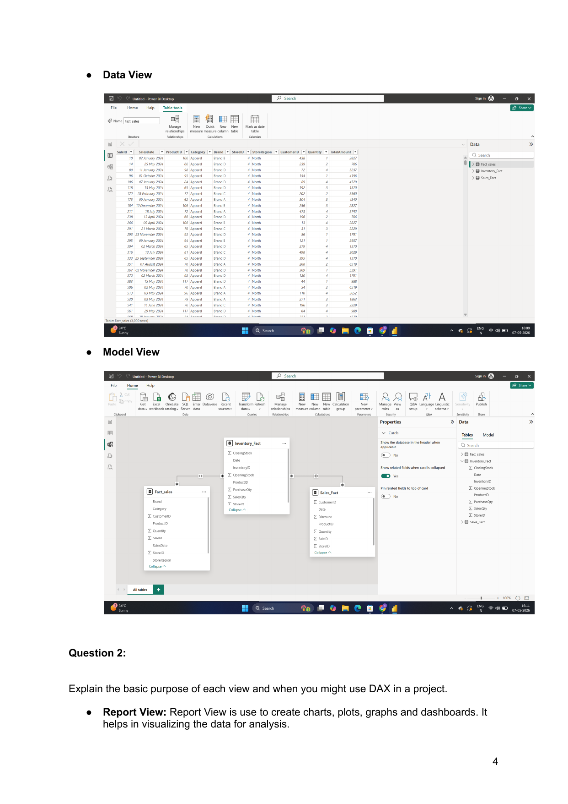

# Task 1 — Getting Started with Power BI

Installation, interface setup, and the Report/Data/Model view workflow

**Skills:** Power BI Desktop setup · Options & settings configuration · Report/Data/Model views · Regional settings

## What I Did

This was my first task, so it was really just about getting Power BI installed and comfortable to navigate.

I installed Power BI Desktop and worked through **File → Options and settings → Options** to explore what's configurable. I enabled Preview Features (I turned on all of them just to see what was available, including the new format pane), adjusted Data Load settings, and set my Regional Settings to India for this file.

Then I created a blank report and spent time just switching between the three core views — **Report View**, **Data View**, and **Model View** — to build a mental map of where everything lives before diving into real work.

**On preview features**, my takeaway was that they let you try new tools before official release, which helps with productivity and staying current, though they can be buggy since they're primarily for testing and feedback.

**On the three views**, here's how I understood each one: Report View is where you build the actual charts and dashboards for analysis. Data View lets you see what's actually inside your tables after loading — the raw shape of the data. Model View is where you connect multiple tables together based on shared keys, which matters a lot once you're working with more than one table. And DAX comes in whenever you need calculations beyond what's already in your raw data — totals, averages, custom business logic.

## 📁 Files
| File | Description |
|------|-------------|
| `Task-01-Submission.pdf` | Screenshots of the install/setup, Options changes, and all three views, plus my written answers |
| `Screenshots/model-view-preview.png` | Model View screenshot showing Fact_sales, Inventory_Fact, and Sales_Fact tables connected |
