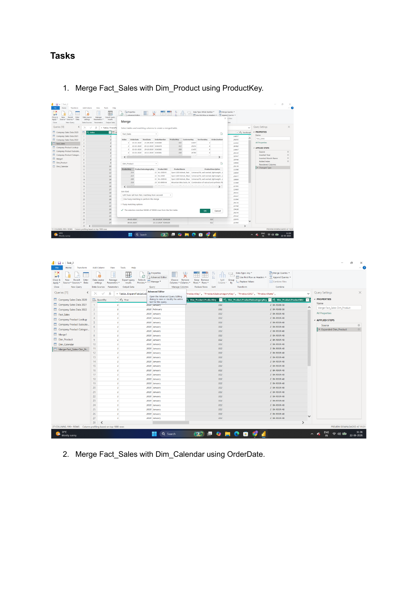

# Task 2 — Sales Data Integration & Modeling

Consolidating raw sales data, building a product hierarchy and calendar table, and validating the full data model

**Skills:** Power Query (Append & Merge) · Data type validation · Custom columns · Fact/Dimension table design · Data integration validation

## What I Did

This is where things got real — pulling together multiple years of raw sales CSVs into something usable, playing the role of a BI analyst at a retail company.

**Consolidating sales data:** I loaded three years of sales CSVs (2020, 2021, 2022) into Power Query and appended them into a single table, which I renamed `Fact_Sales`. I checked the data types carefully — OrderDate and StockDate as Date, OrderQuantity as Whole Number — then added Year and Month Name columns extracted from OrderDate, plus an Index column starting from 1.

- **Highest order quantity** came in 2022, at 45,314 units
- **Top 3 months** by order quantity were June, May, and December
- Record counts per year after appending: 2022 (29,481), 2021 (23,935), 2020 (2,630)

**Building the product hierarchy:** I merged Product Lookup with Product Subcategories, then merged that result with Product Categories, validated that ProductKey was unique, and added a Profit Margin column (Price − Cost). Renamed the final query `Dim_Product`.

- The category with the most products was **Components**
- Average profit margin by category came out positive across the board — no negative-margin categories — with **Accessories (21.1)** and **Clothing (26.6)** as the lowest-margin categories

**Calendar prep:** Converted the date column properly and added Year, Month Number, Month Name, and Week Number columns, renamed to `Dim_Calendar`.

- 2022 turned out to have missing dates — only 181 days recorded instead of 365, suggesting the data was only collected through June/July of that year
- That incomplete year also shows up in the week numbers: 2020 maxed out at 53 weeks and 2021 at 52, while 2022 came in lower because of the partial data

**Integration check:** Merged `Fact_Sales` with both `Dim_Product` and `Dim_Calendar`, and validated there were no duplicates and data types stayed correct after merging.

- By category, **Accessories** was the top-performing product line by total order quantity (57.8K)
- As a final sanity check, I recalculated Year-wise order quantity from this fully merged view and confirmed it matched what I'd calculated back in Part 1 — confirming the integration held together correctly

## 📁 Files
| File | Description |
|------|-------------|
| `Task-02.pbix` | The Power BI file with Fact_Sales, Dim_Product, and Dim_Calendar built out |
| `Task-02-Submission.pdf` | Screenshots of each part plus written answers |
| `Screenshots/order-quantity-by-category.png` | Total order quantity by product category, showing Accessories in the lead |
