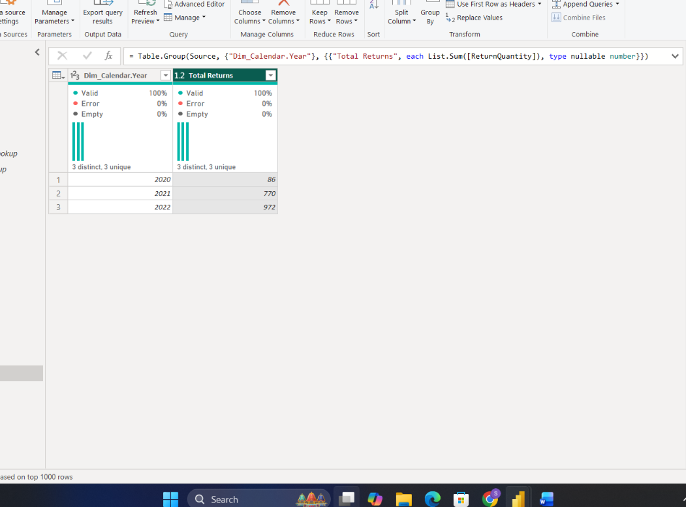

# Task 3 — Returns Analysis & Territory Integration

Building out the returns side of the model and bringing geography into the picture for the first time

**Skills:** Data validation & cleaning · Territory/geography dimension · Conditional columns · DAX measures (DIVIDE, CALCULATE, COUNTROWS) · Summary/aggregation queries

## What I Did

This task shifted focus to the other side of the business — returns — and brought territory/geography data into the model for the first time.

**Returns data prep:** Loaded the returns CSV, converted ReturnDate to a proper Date type, validated ReturnQuantity as numeric, and renamed the query `Fact_Returns`.

- Total ReturnQuantity across the dataset came to **1,828**
- Returns span **18 January 2020 to 30 June 2022** — about 2.5 years — meaning they were spread continuously over time rather than clustered in a short window

**Territory dimension:** Cleaned up Region, Country, and Continent columns (removing extra spaces and formatting inconsistencies), and renamed the query `Dim_Territory`.

- **North America** has the most regional coverage with 6 regions, followed by Europe (3) and Pacific (1)

**Reusing Product & Calendar:** Rather than rebuilding from scratch, I reused the same `Dim_Product` and `Dim_Calendar` hierarchy logic from Task 2, just extended for this dataset.

**Merging everything together:** Joined `Fact_Returns` with `Dim_Product` (on ProductKey), `Dim_Territory` (on TerritoryKey), and `Dim_Calendar` (on ReturnDate). Then I added a conditional column classifying each return as **High Returns** (ReturnQuantity ≥ 2) or **Low Returns** otherwise.

**Some of what I found:**
- By product category, **Accessories accounted for the most returns (1,130)**, well ahead of Bikes (429) and Clothing (269)
- Returns peaked in **May (190), April (183), and June (179)**, with July (48) the quietest month
- Of 1,809 total return records, only **1.05% were classified as High Returns** — the vast majority of returns come in below the ReturnQuantity ≥ 2 threshold
- **Southwest** had the highest concentration of High Returns (16), ahead of Australia and Canada (8 each)
- The single highest Category–Continent combination was **North America–Accessories, at 569 returns**
- Year-over-year, returns have been **climbing steadily from 2020 through 2022** rather than staying flat — worth flagging for further investigation into what's driving the increase
- **2022 had missing dates** — only 181 days recorded instead of a full 365, suggesting the data was likely only collected through June/July of that year, which also explains why 2022 showed fewer weeks (max week numbers: 2020 had 53, 2021 had 52, 2022 had fewer due to the incomplete data)

**Wrapping up:** After merging, I built summary queries for Total Returns by Category, by Continent, and by Year, then did a final pass validating that key columns had no nulls/errors, data types were correct, and the High/Low Returns classification held up against the underlying data — confirming the dataset was actually reporting-ready.

## 📁 Files
| File | Description |
|------|-------------|
| `Task-03.pbix` | The Power BI file with Fact_Returns and Dim_Territory added to the model |
| `Task-03-Submission.pdf` | Screenshots of each part plus written answers |
| `Screenshots/returns-dashboard-overview.png` | Summary dashboard covering regional coverage, category/continent breakdowns, and High vs. Low Returns split |
