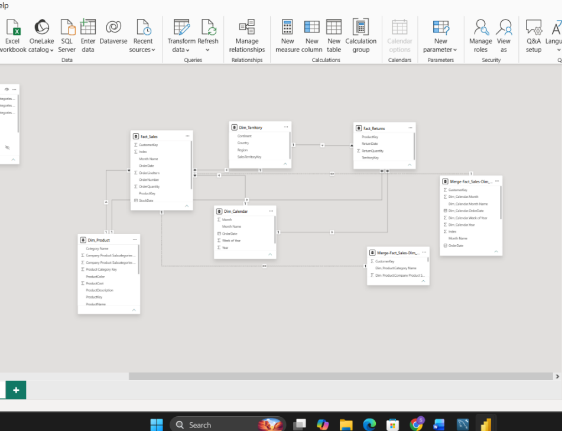

# Task 4 — Data Model Design & Optimization

Wiring the fact and dimension tables together into a validated Star Schema — no more Power Query, pure Model View work

**Skills:** Model View relationships · Star Schema validation · Cardinality (Many-to-One) · Active/Inactive relationship behavior · Return risk analysis

## What I Did

By this point I had all my fact and dimension tables ready from Tasks 2 and 3, so this task was purely about wiring them together correctly in Model View — no more Power Query changes allowed.

**Classifying and validating tables:** In Model View, I sorted my tables into Fact tables (`Fact_Sales`, `Fact_Returns`) and Dimension tables (`Dim_Product`, `Dim_Calendar`, `Dim_Territory`), and checked each dimension table for duplicate keys.

**Building the relationships:** I created six relationships, all Many → One from the fact tables to the dimensions:
- `Fact_Sales` → `Dim_Product` (ProductKey)
- `Fact_Sales` → `Dim_Calendar` (OrderDate)
- `Fact_Sales` → `Dim_Territory` (TerritoryKey)
- `Fact_Returns` → `Dim_Product` (ProductKey)
- `Fact_Returns` → `Dim_Calendar` (ReturnDate)
- `Fact_Returns` → `Dim_Territory` (TerritoryKey)

**Testing relationship behavior:** I deliberately set one relationship to Inactive to see what would break. With `Fact_Returns` → `Dim_Calendar` active, return quantities filtered correctly by month. Once I made it inactive, the same total (1,828) showed up repeated for every month — a clear, concrete demonstration of why inactive relationships can quietly produce misleading numbers if you're not paying attention. I restored it afterward.

I confirmed the model follows a **Star Schema** — both fact tables connect directly to the shared dimension tables, with no snowflaking.

**What the visuals told me:**
- **Accessories** had both the highest sales and highest return quantity — makes sense given its volume, but it's still the category carrying the most return risk in absolute terms
- Sales grew hugely from ~1K (2020) to ~45K (2022), while returns stayed comparatively flat — 2022 did record the highest return quantity, but nothing resembling an anomaly relative to that sales growth
- Looking at return *ratio* by continent (not just volume), **Pacific** came out highest at 2.3%, just ahead of Europe (2.2%) and North America (2.1%) — a subtler finding than just looking at raw counts

## 📁 Files
| File | Description |
|------|-------------|
| `Task-04.pbix` | The Power BI file with the full relationship model built out |
| `Task-04-Submission.docx` | Screenshots of each part plus written answers *(no PDF export was made for this one)* |
| `Screenshots/model-view-star-schema.png` | Model View showing the Star Schema — both fact tables connected to the shared dimensions |
