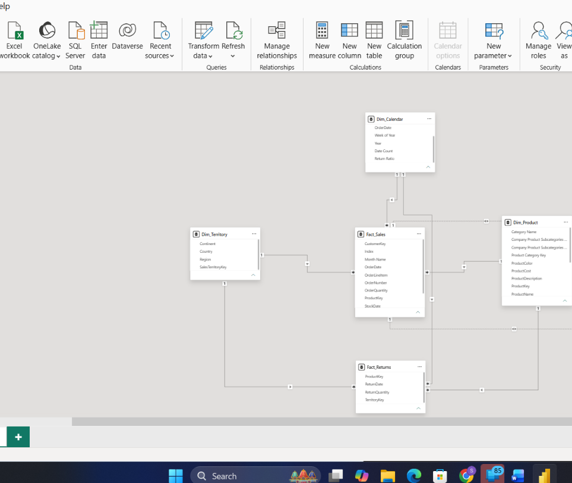

# Task 6 — Model Optimization & Usability Enhancement

Turning a functionally correct model into one that's actually pleasant to work in

**Skills:** Model View layout · Data formatting & data categories · Hierarchies (Calendar, Product, Territory) · Report View usability validation

## What I Did

With the model functionally solid, this task was about making it actually pleasant to work in — for me and for anyone else who'd open this file later.

**Cleaning up the Model View layout:** I rearranged the tables into a clear Star Schema shape — fact tables in the middle, dimensions arranged around them — and made sure the relationship lines didn't overlap and the whole thing read logically left-to-right.

**Fixing data formats and categories:** Went column by column and applied the correct format to each — dates as Date, quantities as Whole Number, prices/costs/profit margin as Decimal Number. Then assigned proper Data Categories so Power BI understands the geographic fields correctly: Country → Country, Continent → Continent, and the date fields as Date.

**Building hierarchies:** This is the part I found most satisfying — instead of dragging individual fields into visuals every time, I built three reusable hierarchies:
- **Calendar Hierarchy** → Year → Month Name
- **Product Hierarchy** → Category → Subcategory → Product Name
- **Territory Hierarchy** → Continent → Country → Region

**Validating in Report View:** Switched over to Report View and confirmed the hierarchies actually worked as expected, that hidden columns weren't cluttering the Fields pane, and that field names were readable. Built two quick visuals — Total Sales by Category and Year-Wise Return Quantity — using the new Product and Calendar hierarchies, just to prove they drill down properly in practice, not just in theory.

## 📁 Files
| File | Description |
|------|-------------|
| `Task-06.pbix` | The Power BI file with the optimized model and hierarchies |
| `Task-06-Submission.pdf` | Screenshots of each part |
| `Screenshots/star-schema-layout.png` | Model View after cleanup — fact tables centered, dimensions arranged around them, no overlapping relationship lines |
