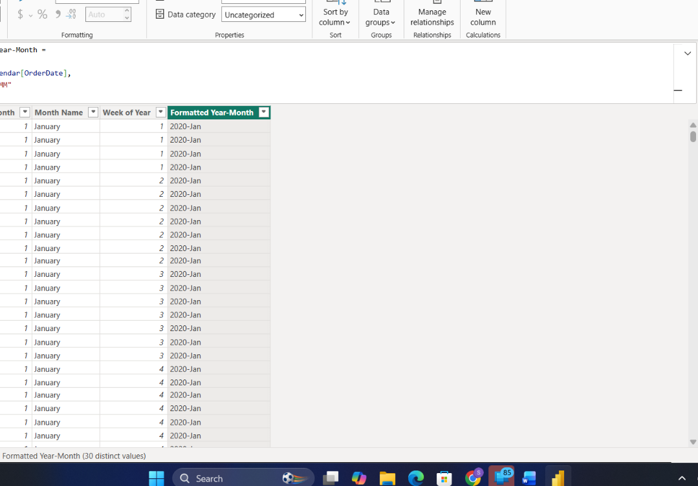

# Task 8 — Conditional Logic, SWITCH & Text Functions in DAX

Turning raw numbers into labels a business user could actually read at a glance, instead of making them interpret figures themselves

**Skills:** IF / conditional measures · SWITCH(TRUE()) multi-tier classification · Text functions (UPPER, concatenation, date formatting) · Business-readable labeling

## What I Did

This task was about turning raw numbers into labels a business user could actually read at a glance, instead of making them interpret figures themselves.

**Basic conditional measures:** Built a **Sales Performance Label** (High Sales if Total Sales Quantity ≥ 1000, Low Sales otherwise) and a **Return Risk Flag** (High Risk if Return Rate > 0.2, Low Risk otherwise) using straightforward `IF` logic.

**SWITCH for multi-tier classification:** Rather than nesting IFs for a 4-level classification, I used `SWITCH(TRUE())` to build a **Sales Band** measure:
- Very High → ≥ 2000
- High → ≥ 1000
- Medium → ≥ 500
- Low → below that

I applied this across Product Categories and Territories to see how each one classified:
- By category: **Accessories, Bikes, and Clothing all landed in Very High**, while **Components was the outlier at Low**
- By region: most regions came out Very High, but **Central, Northeast, and Southeast all landed in Low** — a clear geographic split worth digging into further
- By year: 2020, 2021, and 2022 all classified as Very High, so the banding held steady across the full time range

**Text functions:** Built a few label-style outputs:
- **Product Display Name** — converted to UPPER case
- **Category–Subcategory Label** — concatenated as `Category - Subcategory`
- **Formatted Year-Month** — dates reformatted to `YYYY-MMM` for cleaner axis labels

**Putting it together in visuals:** Built out Sales Performance by Category, Return Risk by Territory (Country), and Sales Band distribution across Years to confirm the labels actually made sense once plotted, not just in isolation.

## 📁 Files
| File | Description |
|------|-------------|
| `Task-08.pbix` | The Power BI file with the conditional logic and text measures |
| `Task-08-Submission.pdf` | Screenshots of each part |
| `Screenshots/sales-performance-return-risk.png` | Sales Performance by Category next to Return Risk by Country |
