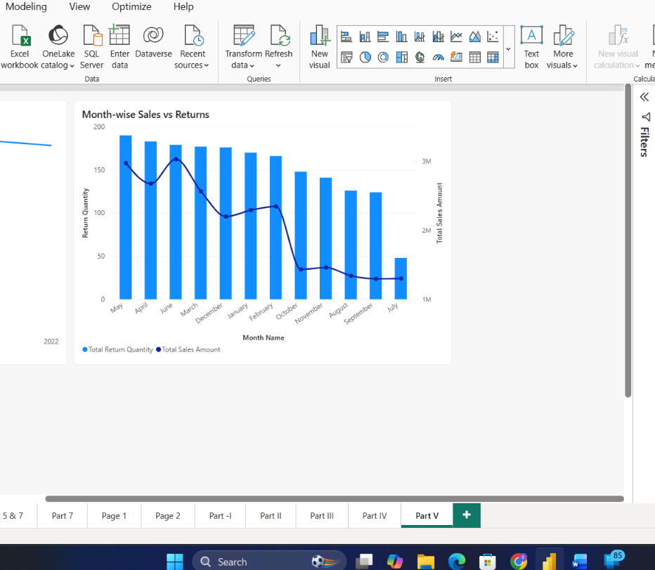

# Task 9 — Time Intelligence with DAX

Getting comfortable with Power BI's date/time functions — the building blocks for anything that compares performance across periods

**Skills:** DAX date functions (YEAR, MONTH, FORMAT) · Period comparison measures · Month-to-Date calculations · Calendar Hierarchy analysis

## What I Did

This task got me comfortable with Power BI's date/time functions — the building blocks for anything that compares performance across periods.

**Basic date measures:** Today's Date, Current Year, and Current Month Name — simple, but useful groundwork for anything that needs to reference "now" dynamically.

**Breaking sales down by date components:** Using `YEAR()`, `MONTH()`, and `FORMAT()`, I built Sales Quantity by Year, Sales Quantity by Month, and Returns Quantity by Year.

**Period comparisons:** Sales This Year and Sales Last Year measures, so I could start comparing performance across time rather than just looking at flat totals.

**Month-level analysis:** Added a Month-to-Date Sales measure and used the Calendar Hierarchy to identify which month had the highest sales — **June came out on top, with total sales of 3.03M**.

**Bringing it together in visuals:** Year-wise Sales Trend, Month-wise Sales vs Returns, and Current Year vs Last Year Sales.

**What I found:**
- **2021 was the best-performing year**, with total sales amount around **9.32M** — ahead of both 2020 (6.40M) and 2022 (9.19M). Interestingly, 2022 had a higher total order *quantity* than 2021, so revenue value and unit volume weren't telling quite the same story — a useful distinction to notice rather than assume they always move together.
- **Returns are trending down over time** — the Month-wise chart showed return quantity declining from around 190 in the higher-return months to about 50 in the lowest, with only minor fluctuations along the way.

## 📁 Files
| File | Description |
|------|-------------|
| `Task-09.pbix` | The Power BI file with the time intelligence measures |
| `Task-09-Submission.pdf` | Screenshots of each part plus written answers |
| `Screenshots/sales-trend-vs-returns.png` | Month-wise Sales vs Returns and Current Year vs Last Year Sales visuals |
