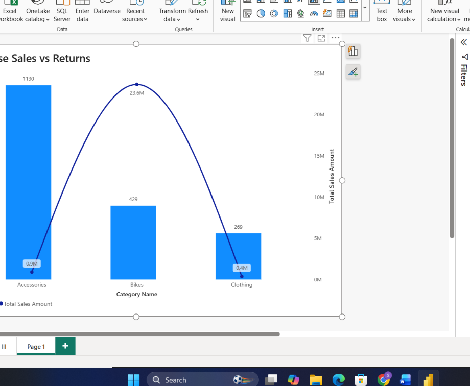

# Task 10 — RELATED, CALCULATE & Measure Totals

Two of DAX's most important — and most easily misunderstood — functions: RELATED for pulling data across a relationship, CALCULATE for changing filter context deliberately

**Skills:** RELATED (cross-table lookups) · CALCULATE (context transition) · Measure total validation · Iterator-based cross-checking

## What I Did

This task pushed into two of DAX's most important — and most easily misunderstood — functions: `RELATED` for pulling data across a relationship, and `CALCULATE` for changing filter context deliberately.

**Using RELATED to pull across relationships:** Added calculated columns in Fact_Sales for Product Category and Sales Year (both pulled via `RELATED` from the dimension tables), and a Return Continent column in Fact_Returns, also via `RELATED`. This is the row-level way of "reaching across" a relationship to grab a related value.

**CALCULATE for filtered measures:** Built Sales for Selected Year, Bike Sales (filtering Category = "Bikes"), and Europe Returns — each using `CALCULATE` to override or add filter context on top of a base measure.

**Checking measure totals behave correctly:** Built a table with Product Category and Total Sales Quantity, and looked closely at whether the row-level values and the grand total made sense together — the Accessories, Bikes, and Clothing rows summed to **84,174**, which matched the Grand Total exactly. Then wrote a validation measure using iterator logic to independently confirm the totals matched what the visual was showing — a good habit for catching subtle aggregation bugs before they end up in a report someone trusts.

**Validating with visuals:** Category-wise Sales vs Returns, Year-wise Sales using the RELATED columns, and Continent-wise Return Analysis.

**What I found:**
- Using `CALCULATE`, **Bikes** came out as the highest-sales category, with total sales amount around **24 million**
- **North America** had the highest return volume, at **871 units** — a useful data point for where returns-related process fixes might have the most impact

## 📁 Files
| File | Description |
|------|-------------|
| `Task-10.pbix` | The Power BI file with RELATED columns and CALCULATE-based measures |
| `Task-10-Submission.pdf` | Screenshots of each part plus written answers |
| `Screenshots/business-validation-visuals.png` | Category-wise Sales vs Returns, Year-wise Sales, and Continent-wise Return Analysis |
