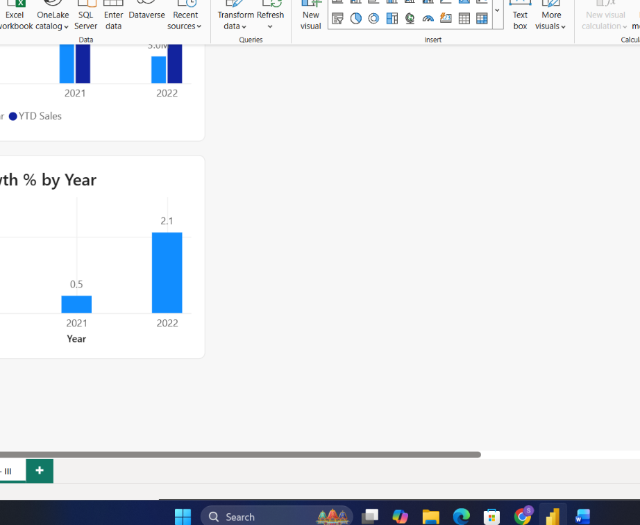

# Task 12 — Time Intelligence Patterns in DAX

Building on Task 9's basics into the standard time intelligence patterns that show up in nearly every real BI report — YTD, YoY growth, rolling averages

**Skills:** Date Table setup · YTD (Year-to-Date) · YoY Growth % · Rolling averages · Month-over-Month growth

## What I Did

Building on the basics from Task 9, this task moved into the actual standard time intelligence patterns that show up in nearly every real BI report — YTD, YoY growth, rolling averages.

**Setting up properly for time intelligence:** Before writing any of the growth measures, I made sure `Dim_Calendar` had continuous, unbroken dates and marked it explicitly as a **Date Table** in Power BI — a required step for time intelligence functions to behave correctly. I also verified the relationships in Model View: `Dim_Calendar[OrderDate] → Fact_Sales[OrderDate]` and `Dim_Calendar[OrderDate] → Fact_Returns[ReturnDate]`, both One-to-Many and Active.

**Core time intelligence measures:**
- **Year-to-Date (YTD) Sales**
- **Previous Year Sales**
- **Year-on-Year (YoY) Growth %**

**Moving and comparative measures:**
- **Rolling 3-Month Sales**
- **Month-over-Month Growth**

**Validating with visuals:** Built out Sales YTD vs Previous Year, YoY Growth % by Year, and a Rolling 3-Month Sales Trend to see these patterns actually play out visually rather than just as numbers in a card.

This was a good one for really cementing why the Date Table setup matters — these functions quietly fail or give wrong numbers if the calendar table isn't marked correctly, so getting that step right first paid off for everything after it.

## 📁 Files
| File | Description |
|------|-------------|
| `Task-12.pbix` | The Power BI file with the time intelligence measures |
| `Task-12-Submission.pdf` | Screenshots of each part |
| `Screenshots/time-intelligence-visuals.png` | Sales YTD vs Previous Year, YoY Growth % by Year, and Rolling 3-Month Sales Trend |
