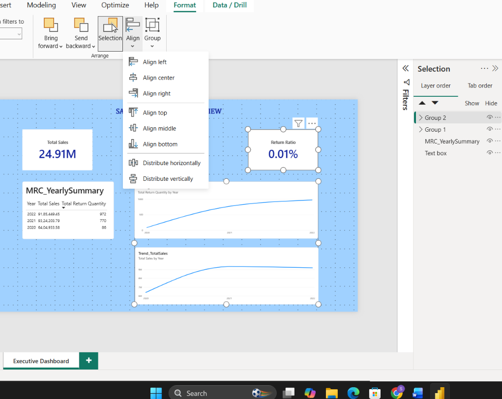

# Task 13 — Executive Dashboard Design

After 12 tasks of modeling and DAX, this is where the work finally became visible — building an actual dashboard page instead of just measures sitting in the background

**Skills:** Dashboard page setup · KPI card design · Selection Pane management (naming, grouping) · Visual alignment & distribution

## What I Did

After 12 tasks of modeling and DAX, this is where the work finally became visible — building an actual dashboard page instead of just measures sitting in the background.

**Setting up the page:** Created a new page named **Executive Dashboard**, set it to 16:9, turned off unnecessary gridlines, and applied a clean background. Added a text box title ("Sales & Returns Overview") and mentally split the page into three zones — Header, KPI Section, and Trend Section — before placing a single visual.

**KPI cards:** Added Card visuals for Total Sales, Total Returns, and Return Ratio (%). For the summary of Year, Total Sales, and Total Returns together, the task called for a Multi-Row Card — but that visual wasn't available in my version of Power BI Desktop, so I used a Table visual instead to display the same summary information. Worth noting as a real example of adapting to what the tool actually gives you rather than what the spec assumes.

**Naming everything properly:** Renamed each visual in the Selection Pane — `KPI_TotalSales`, `KPI_TotalReturns`, `KPI_ReturnRatio`, `MRC_YearlySummary` — a habit that makes it much easier to manage a page once it has more than a couple of visuals on it.

**Grouping and alignment:** Grouped the KPI cards together and the trend visuals together in the Selection Pane, then made sure horizontal spacing was even across the KPIs and vertical spacing was even down the trend section. Small thing, but it's the difference between a dashboard that looks intentional and one that looks thrown together.

## 📁 Files
| File | Description |
|------|-------------|
| `Task-13.pbix` | The Power BI file with the Executive Dashboard page |
| `Task-13-Submission.pdf` | Screenshots of each part |
| `Screenshots/executive-dashboard.png` | The finished Executive Dashboard after grouping and alignment |
