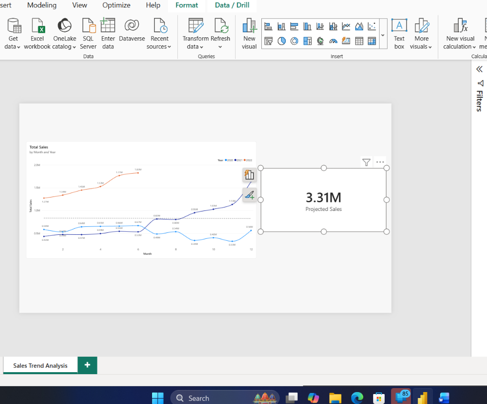

# Task 14 — Sales Trend & Forecast Analysis

A focused, single-visual task, but a genuinely useful one — building a trend line that doesn't just show the past, but projects forward

**Skills:** Line chart formatting · Analytics pane trend lines · Forecasting workaround via custom DAX · Selection Pane naming & alignment

## What I Did

Created a new page called **Sales Trend Analysis** and built a Line Chart with Month Name on the X-axis (from Dim_Calendar), Total Sales on the Y-axis, and Year in the legend — so I could compare the same months across different years on one chart.

**Formatting:** Turned on data markers, enabled the smooth line option, and added clear axis titles so the chart wasn't just a bare line with no context.

**Trend line:** Using the Analytics pane, I added a Trend Line to Total Sales, formatted for clear visibility.

**Working around a missing feature:** The task called for a native Forecast (3–6 months, with confidence interval) added through the Analytics pane — but that feature wasn't available in my version of Power BI Desktop. Rather than skip it, I calculated the projection myself using a custom DAX measure and displayed it in a card visual. The projected sales amount came out to **3.31 million** — so the forward-looking insight the task was after still came through, just via a different route than the spec assumed.

**Final touches:** Renamed the visual `LC_SalesTrend_Forecast` in the Selection Pane and centered it properly on the page.

This one was a nice change of pace from pure DAX work — more about picking the right visual settings (and working around a tooling gap) than writing formulas, but just as important for making a report actually useful to someone deciding where the business is headed.

## 📁 Files
| File | Description |
|------|-------------|
| `Task-14.pbix` | The Power BI file with the trend line chart and the custom DAX forecast card |
| `Task-14-Submission.pdf` | Screenshots of each part |
| `Screenshots/sales-trend-forecast.png` | The formatted trend line chart alongside the custom forecast card |
