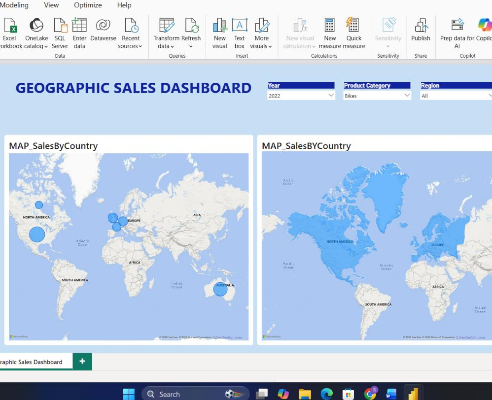

# Task 17 — Geographic Sales Dashboard

Bringing the geographic dimension to life visually — actually seeing where sales come from on a map, rather than just reading Region and Continent as text columns

**Skills:** Bubble maps · Filled maps · Geographic tooltips · Slicer syncing · Map interactivity validation

## What I Did

This task brought the geographic dimension to life visually — actually seeing where sales come from on a map, rather than just reading Region and Continent as text columns.

**Page setup:** Created a new page named **Geographic Sales Dashboard**.

**Bubble map:** Built a Map visual using Country (from Dim_Territory) for location and Total Sales for bubble size, with Region and Continent set as tooltip fields so hovering over any country gives extra context without cluttering the map itself. Renamed it `MAP_SalesByCountry`.

**Filled map:** Added a Filled Map at the Continent level, using color saturation to represent Total Sales — a nice complementary view to the bubble map, showing regional intensity at a glance rather than precise country-level detail. Renamed it `MAP_SalesByContinent`.

**Slicers:** Added Year, Product Category, and Region slicers in dropdown style, synced across the page.

**Interactivity validation:** Checked that clicking a country or continent on either map correctly updated the other visuals on the page, and that the slicers properly drove both maps without any breaks or ambiguous behavior.

**Layout:** Kept the map as the visual focal point of the page, with slicers arranged neatly around it and no overlapping labels — geographic visuals can get messy fast if labels crowd each other, so I paid extra attention to spacing here.

## 📁 Files
| File | Description |
|------|-------------|
| `Task-17.pbix` | The Power BI file with the Geographic Sales Dashboard page |
| `Task-17-Submission.pdf` | Screenshots of each part |
| `Screenshots/geographic-sales-dashboard.png` | The finished dashboard — bubble map, filled map, and synced slicers |
