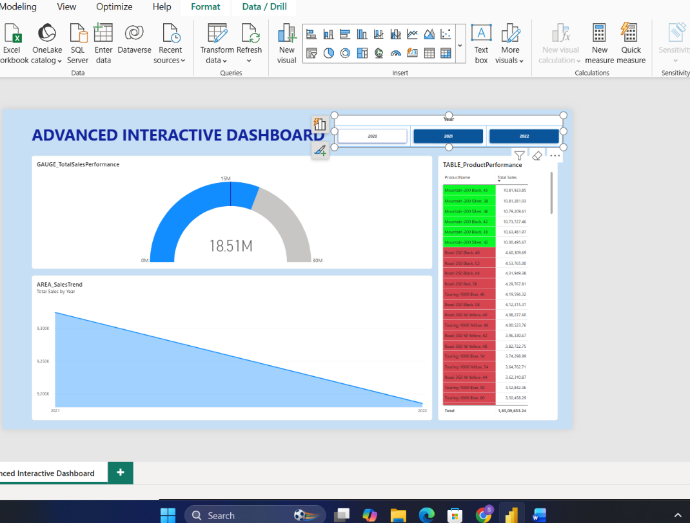

# Task 18 — Advanced Interactive Dashboard

Probably the most technically demanding dashboard task — combining goal-tracking visuals, drill hierarchies, and some genuinely subtle DAX filter-context behavior

**Skills:** Gauge charts · Drill hierarchies (Year → Month) · HASONEVALUE filter-context behavior · Dynamic conditional formatting

## What I Did

Probably the most technically demanding dashboard task — combining goal-tracking visuals, drill hierarchies, and some genuinely subtle DAX filter-context behavior.

**Page setup:** Created a new page named **Advanced Interactive Dashboard**.

**Gauge chart:** Built a Gauge visual with Total Sales as the value and a benchmark target, with a clear min/max range and a meaningful title. Renamed it `GAUGE_TotalSalesPerformance`.

**Area chart with drill hierarchy:** Built an Area chart using the Year → Month hierarchy from Dim_Calendar on the X-axis and Total Sales on the Y-axis, with drill down and drill up both enabled. Renamed it `AREA_SalesTrend`.

**Validating drill behavior:** Tested drilling from Year down into Month, then back up to Year again, and confirmed cross-highlighting between the area chart and other visuals worked as expected in both directions.

**HASONEVALUE behavior:** This was the trickiest part — I applied a Year/Category filter and specifically checked how the Gauge and Area chart behaved differently when exactly one value was selected versus multiple values. The goal was making sure neither visual produced a misleading aggregation when multiple items were selected at once, which is exactly the kind of thing `HASONEVALUE` is meant to guard against in more advanced measures.

**Advanced conditional formatting:** Applied dynamic color formatting to the area chart (high values in a stronger color, low values more muted), and confirmed the formatting actually updated live as filters changed — not just a static one-time color assignment.

**Layout:** Made sure the drill icons stayed visible, nothing overlapped, and every visual was properly renamed in the Selection Pane.

## 📁 Files
| File | Description |
|------|-------------|
| `Task-18.pbix` | The Power BI file with the Advanced Interactive Dashboard page |
| `Task-18-Submission.pdf` | Screenshots of each part |
| `Screenshots/advanced-interactive-dashboard.png` | The finished dashboard — gauge, drillable area chart, and dynamic conditional formatting |
