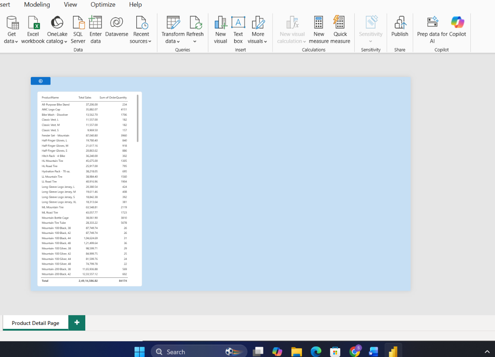

# Task 19 — Drill-Through & Report Interactions

Report navigation — letting someone click from a high-level view straight into detail, and controlling exactly which visuals respond to each other

**Skills:** Drill-through page setup · Back button navigation · Report interaction control (filter vs. no filter) · Interaction validation

## What I Did

This task was about report navigation — letting someone click from a high-level view straight into detail, and controlling exactly which visuals respond to each other.

**Drill-through detail page:** Created a new page called **Product Detail Page** and enabled drill-through on it using Product Category (or Product Name). Added a Table/Matrix showing Product, Total Sales, and Order Quantity, plus a supporting chart of Sales by Year/Month — made sure the drill-through filter pane stayed visible so it's obvious the page is filtered based on whatever was clicked to get there.

**Back button:** Added a button with the Back action assigned, renamed `BTN_BackToSummary`, so navigating back to the summary page feels natural rather than requiring the page-navigation tabs.

**Managing report interactions:** On the summary page, I went through the visuals and explicitly decided which ones should filter each other when clicked, and which shouldn't. Key comparison visuals (like the bar/line charts) I left with interactions turned on, while KPI summary cards I turned interactions off for — since those are meant to always show the overall picture, not get filtered down just because someone clicked a bar in a chart nearby.

**Validation:** Clicked through the report to confirm clicking a chart correctly filtered the visuals it was supposed to, that the KPI cards stayed unaffected as intended, and that drill-through only triggered from the specific visuals it was set up on — not from anywhere on the page.

## 📁 Files
| File | Description |
|------|-------------|
| `Task-19.pbix` | The Power BI file with the drill-through page and interaction settings |
| `Task-19-Submission.pdf` | Screenshots of each part |
| `Screenshots/drillthrough-detail-page.png` | The Product Detail Page with the visible drill-through filter pane and back button |
