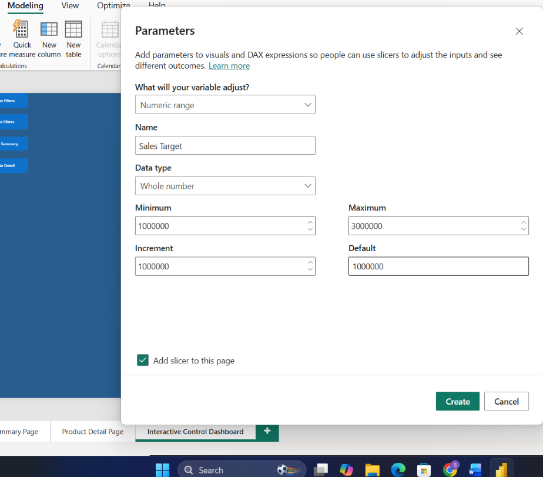

# Task 20 — Bookmarks, Navigation & Parameters

The final task in the series, and a fun one — this is where the report started feeling less like a static file and more like an actual app

**Skills:** Bookmarks (scoped visibility toggles) · Navigation buttons · What-If parameters · Real-time visual updates

## What I Did

The final task in the series, and a fun one — this is where the report started feeling less like a static file and more like an actual app, with hideable filter panels and user-adjustable parameters.

**Page setup:** Created a new page called **Interactive Control Dashboard**.

**Slicer panel:** Added Year, Product Category, and Region slicers, grouped them together into a panel named `PANEL_Slicers`, and set the panel to be hidden by default so it doesn't take up screen space until someone actually wants to filter.

**Bookmarks to control the panel:** Created two bookmarks — **Show Filters** and **Hide Filters** — that only control the slicer panel's visibility and don't touch the underlying data state at all. Keeping bookmarks scoped narrowly like this makes them much more predictable to use.

**Navigation buttons:** Added four buttons — Show Filters, Hide Filters, Go to Summary, Go to Detail — wired up so the first two trigger the bookmark actions and the latter two handle page navigation. Renamed everything clearly in the Selection Pane so it's obvious what each button actually does.

**What-If parameter:** Created a What-If parameter for a Sales Target/Threshold, and used it to drive three different visuals dynamically — a Gauge, a Card, and a reference line on a Bar chart. Made sure the parameter slicer was visible and that moving it actually updated all three visuals instantly, rather than just one.

**Final UX pass:** Tested that the slicer panel showed/hid smoothly, all four buttons worked correctly, the parameter updated visuals in real time, and nothing reset unexpectedly when switching between bookmarks or pages.

This was a satisfying task to close the series on — it pulled together a lot of what the earlier tasks built (measures, hierarchies, drill-through, interactions) into something that actually feels like a polished, usable tool.

## 📁 Files
| File | Description |
|------|-------------|
| `Task-20.pbix` | The Power BI file with bookmarks, navigation, and the What-If parameter |
| `Task-20-Submission.pdf` | Screenshots of each part |
| `Screenshots/interactive-control-dashboard.png` | The What-If parameter driving the Gauge, Card, and Bar chart reference line together |
